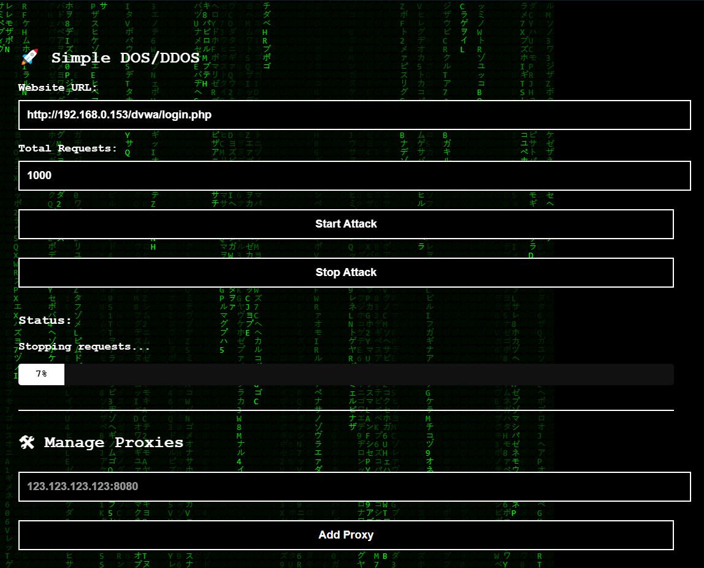

# 🚀 Simple DOS / DDOS Request Sender (Hacker Matrix UI)

A lightweight Python tool to simulate **DOS** (Denial of Service) or **DDOS-like** (distributed multiple request) attacks  
for **educational**, **testing**, or **performance evaluation** purposes —  
built with a hacker-style **Matrix Rain UI**.

---

## 📷 Preview

 <!-- Optional screenshot -->

---

## ⚙️ Features

- 🖥️ Matrix rain animated hacker background (Canvas HTML5)
- ⚡ Send rapid concurrent GET requests (Asyncio + Aiohttp)
- 🌐 Rotate proxies automatically (Optional)
- 🎯 Simulate small-scale **DOS** (Single source) or **basic DDOS** (using proxies)
- ✅ Start and Stop request sending anytime
- 📈 Live real-time success/fail counters
- 🛢️ Store request sessions and proxies into SQLite database
- 🧰 One-click Batch Installer (`setup_run.bat`) for easy startup

---

## 📚 Technologies Used

- Python 3.9+
- Eel (Python GUI bridge to Web)
- aiohttp (High-speed Async HTTP client)
- HTML5 + JavaScript frontend
- SQLite3 Database (built-in)
- Canvas Matrix Rain background

---

## ⚠️ Important Clarification

This tool is intended for:

- ✅ **Educational purposes**
- ✅ **Network performance/load testing**
- ✅ **Ethical use** only on systems **you own** or have **permission** to test

**Unauthorized use on third-party servers is illegal.**  
Use responsibly.

---

## 🛠 Installation (Quick Start)

### Windows Auto-Installer

1. **Clone or Download this repository**:

```bash
git clone https://github.com/Thelung94/Simple-DOS-DDOS.git
cd Simple-DOS-DDOS
setup.bat
